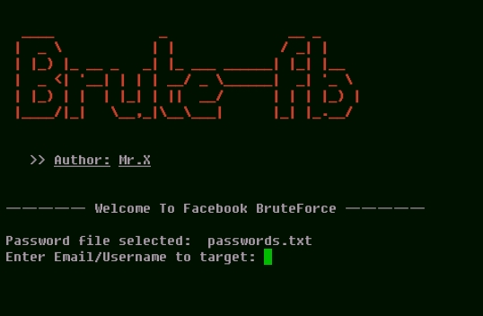

# Brute-fb


## introduction
Bruteforce attack on facebook account using python script code by Mr.X

## Instalations
```
$ pkg update && pkg upgrade
$ pkg install python
$ pkg install python3
$ pkg install git
$ git clone https://github.com/Whomrx666/Brute-fb
$ cd Brute-fb
$ python -m pip install request bs4
$ python -m pip install mechanize
$ python Brute-fb.py
```
## Instructions
- **First**: Install tools according to the instructions above
- **Second**: Enter the victim's Facebook username or email
- **Last**: And the tool will automatically carry out a bruteforce attack on the victim's Facebook

## Protection Against Attacker
* Use Strong Password(which contains standard password chars + longest as possible)
* Use 2F Authentication.
* Make location based login(+browser based).

## Observation
Bruteforce attack, For educational purpose only
### Original Author
<a href="https://github.com/Whomrx666"></a>

### <<< If you copy , Then Give me The Credits >>>

## CONNECT WITH ME :

[](https://whomrxhackers.blogspot.com/)
[](https://twitter.com/whomrx666)
[](https://youtube.com/@whomrx666)
[](https://facebook.com/https://www.facebook.com/whomrx.666)
[](https://t.me/Whomr_X)
[](mailto:whomrx666@gmail.com)
[](https://www.tiktok.com/@whomr.x)

**If you want to donate, click on the button**
<a href="https://saweria.co/whomrx"></a>

### Visitors :


<h3>Good luck for doing bruteforce</h3> 
